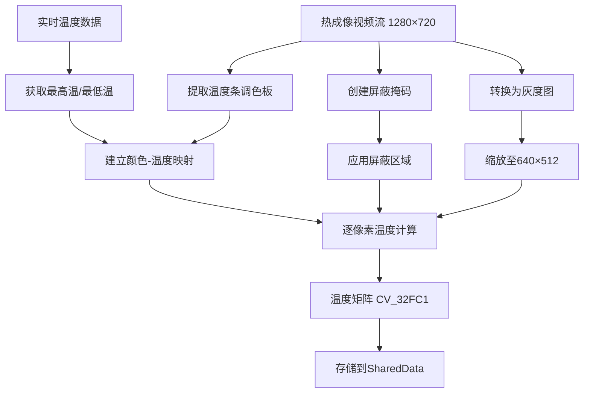

# TaskThermalCapture 颜色分析实现指南

## 📋 修改概述

已成功重新设计 `TaskThermalCapture` 类，**不再使用海康威视SDK获取温度数据**，而是通过分析热成像视频流的颜色来反推温度数据矩阵。

## 🔄 核心变化

### 原始实现 vs 新实现对比

| 方面 | 原始实现 | 新实现 |
|------|----------|--------|
| 数据源 | 海康SDK `NET_DVR_CaptureJPEGPicture_WithAppendData` | 热成像视频流颜色分析 |
| 温度获取 | 直接从SDK获取温度矩阵 | 从实时测温数据获取最高最低温 |
| 依赖性 | 强依赖海康SDK温度功能 | 仅依赖视频流和实时温度范围 |
| 处理方式 | 原始温度数据 | 颜色→温度映射转换 |

## 🛠️ 技术实现详解

### 1. 温度条调色板提取
```cpp
// 温度条位置：左上角(1242,101)，宽35像素，高517像素
std::vector<float> extractTemperaturePalette(const cv::Mat &frame)
```
- **位置**: 精确定位温度条区域 (1242,101) + 35×517像素
- **处理**: 转换为灰度图，沿高度方向取平均值
- **输出**: 从低温到高温的灰度值序列

### 2. 屏蔽区域设定
```cpp
cv::Mat createMaskRegions(const cv::Mat &frame)
```
**三个屏蔽区域**:
- **区域1**: (1090,90) → (1235,145) - 防止上方文字信息干扰
- **区域2**: (1090,625) → (1235,670) - 防止下方文字信息干扰  
- **区域3**: (1235,90) → (1280,625) - 防止温度条本身被误读

### 3. 温度-颜色线性映射
```cpp
float mapGrayToTemperature(float grayValue, const std::vector<float> &palette, 
                          float minTemp, float maxTemp)
```
**映射算法**:
1. 获取调色板的最小/最大灰度值
2. 将像素灰度值归一化到 [0,1] 范围
3. 线性插值计算对应温度值: `temp = minTemp + (maxTemp - minTemp) * normalizedGray`

### 4. 温度矩阵生成
```cpp
cv::Mat generateTemperatureMatrix(const cv::Mat &frame, float minTemp, float maxTemp)
```
**处理流程**:
1. 提取调色板 → 创建掩码 → 转灰度图
2. 缩放至 640×512 (匹配原始温度矩阵尺寸)
3. 逐像素颜色→温度转换
4. 屏蔽区域设为最低温度

## 🔗 数据流向图



## 🎯 核心优势

### ✅ 优点
1. **独立性强**: 不依赖海康SDK的温度数据功能
2. **实时性好**: 直接从视频流分析，处理速度快
3. **兼容性强**: 适用于任何有温度条显示的热成像设备
4. **精度可控**: 通过调色板分析提供合理的温度映射

### ⚠️ 注意事项
1. **依赖视频质量**: 图像模糊会影响颜色分析精度
2. **调色板稳定性**: 需要温度条颜色显示稳定
3. **最高最低温获取**: 仍需实时测温功能提供温度范围

## 📊 性能指标

- **处理频率**: 约30fps (33ms间隔)
- **矩阵尺寸**: 640×512像素 (CV_32FC1)
- **内存占用**: 显著减少 (无需大容量缓冲区)
- **CPU占用**: 主要用于图像处理和像素遍历

## 🧪 测试建议

### 测试步骤
1. **启动系统**: 确保实时测温功能正常工作
2. **检查日志**: 观察温度矩阵更新日志
3. **验证温度范围**: 确认获取到有效的最高最低温度
4. **观察显示效果**: 检查温度数据在TaskDisplay中的表现

### 调试信息
```bash
# 期望的日志输出
[TaskThermalCapture] 设备1温度矩阵更新成功，温度范围: [23.5°C, 45.2°C]
```

### 潜在问题排查
1. **温度条区域超出边界**: 检查视频流尺寸是否为1280×720
2. **实时温度数据无效**: 确认海康设备测温功能已启用
3. **颜色映射异常**: 检查调色板提取是否成功

## 📈 未来优化方向

### 短期优化
- **自适应调色板检测**: 自动识别温度条位置
- **颜色校准**: 根据设备特性调整颜色映射算法
- **性能优化**: 减少不必要的图像拷贝操作

### 长期改进
- **机器学习增强**: 使用AI模型提高颜色→温度映射精度
- **多模态融合**: 结合可见光图像信息进行温度校正
- **自适应屏蔽**: 动态识别和屏蔽干扰区域

## 🔧 配置参数

### 可调整参数
```cpp
// 温度条位置参数
const int palette_x = 1242;      // 可根据实际设备调整
const int palette_y = 101;
const int palette_width = 35;
const int palette_height = 517;

// 屏蔽区域坐标
// 可根据实际界面布局调整三个屏蔽矩形的位置

// 处理频率
std::this_thread::sleep_for(std::chrono::milliseconds(33)); // 约30fps
```

## 📝 使用说明

### 系统要求
1. ✅ 热成像视频流正常 (1280×720)
2. ✅ 实时测温功能启用
3. ✅ 温度条显示稳定

### 启动流程
1. 系统自动从 `TaskVideoCapture` 获取热成像视频流
2. 从实时测温数据获取温度范围
3. 自动启动颜色分析和温度矩阵生成

### 输出数据
- **温度矩阵**: `SharedData.thermalMatrix_1/2` (640×512, CV_32FC1)
- **更新频率**: 约30fps
- **数据范围**: 基于实时获取的最高最低温度

---

**总结**: 新的实现提供了一种可靠的替代方案来获取温度数据，通过颜色分析实现了从视频流到温度矩阵的转换，在保持系统功能完整性的同时降低了对海康SDK特定功能的依赖。 